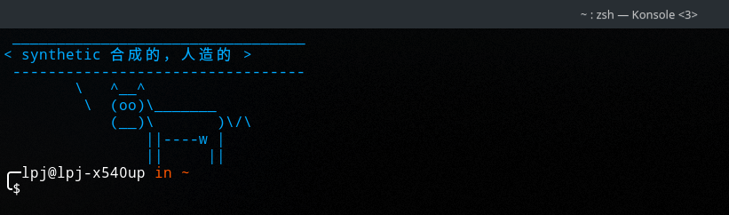
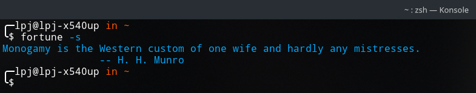
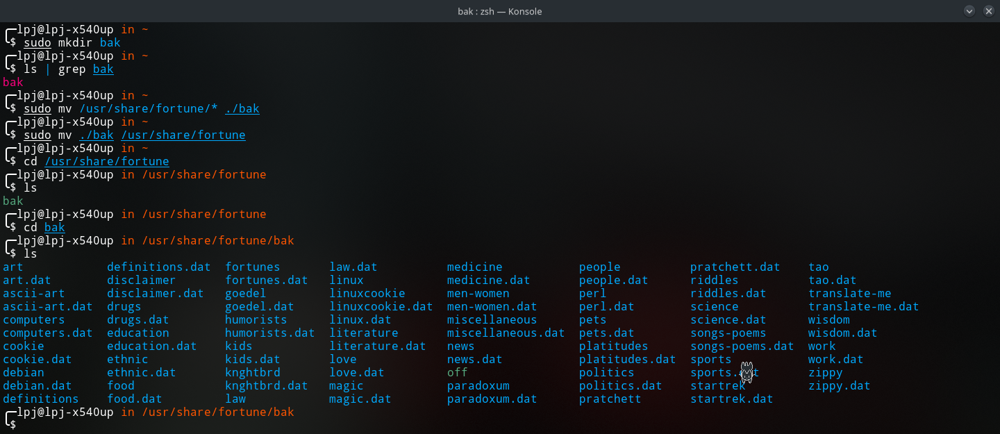

# cowsay_words

> 老牛讲单词：每次打开终端的时候老牛都会给你讲一个英语单词～



### Manjaro Linux

- 安装 fortune-mod

```bash
sudo pacman -S fortune-mod
```

- 现在你应该已经可以在终端输入 ```fortune -s``` 来打印一句随机的名言了。



- 现在，我们移除 fortune-mod 自带的名言库。

```bash
sudo mkdir bak
sudo mv /usr/share/fortune/* ./bak
sudo mv ./bak /usr/share/fortune
```



- 接下来，将本仓库 ```/data``` 目录下存放着的已经制备好的单词库文件放入目录 ```/usr/share/fortune/```

- 制备英语单词库的方法参考了：[link](https://www.ruanyifeng.com/blog/2015/04/fortune.html)

### 买一头会讲单词的老牛吧～

```bash
# 老牛来也～
sudo pacman -S cowsay
```

在 ```~/.bashrc``` 或 ```~/.zshrc``` 文件（根据你使用的 ```shell``` 而定），写入如下代码，那么每次启动终端或重新加载 shell 的配置文件，老牛就会给你讲一个英语单词啦～

```bash
# cowsay words
alias cowsay="fortune -s | cowsay"
cowsay
```
